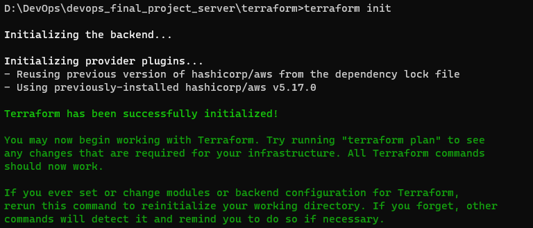
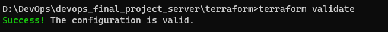
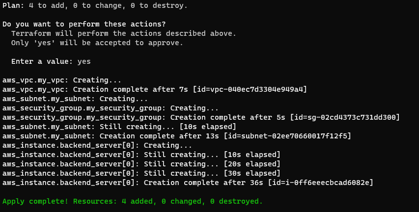
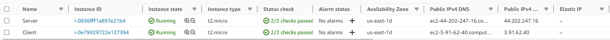
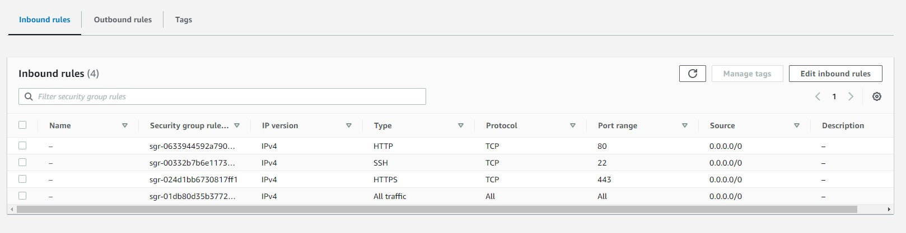
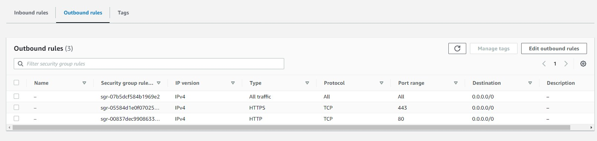
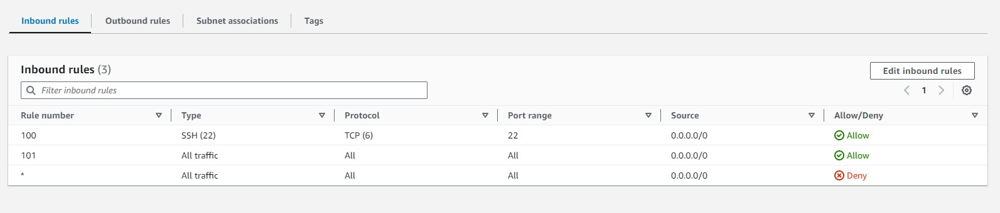
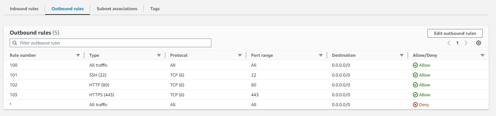
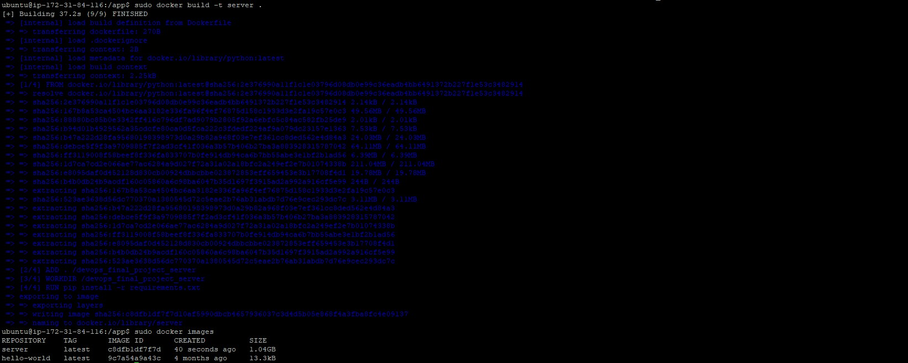
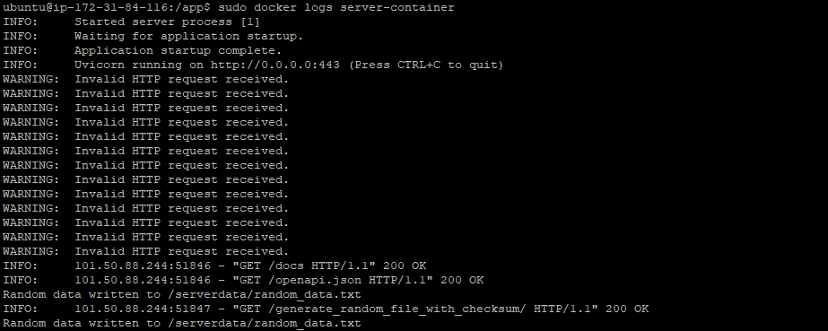

**DevOps Capstone Project**

**Part 2: : Creating server VM, Infra as a Code (IaC)**

**Terraform**

terraform apply

**Instances Created**

**Security Group Inbound and Outbound Rules**

**Network ACL Inbound and Outbound Rules**

**Server Image Building on EC2 Instance**

**Server Container Logs on EC2 Instance**

